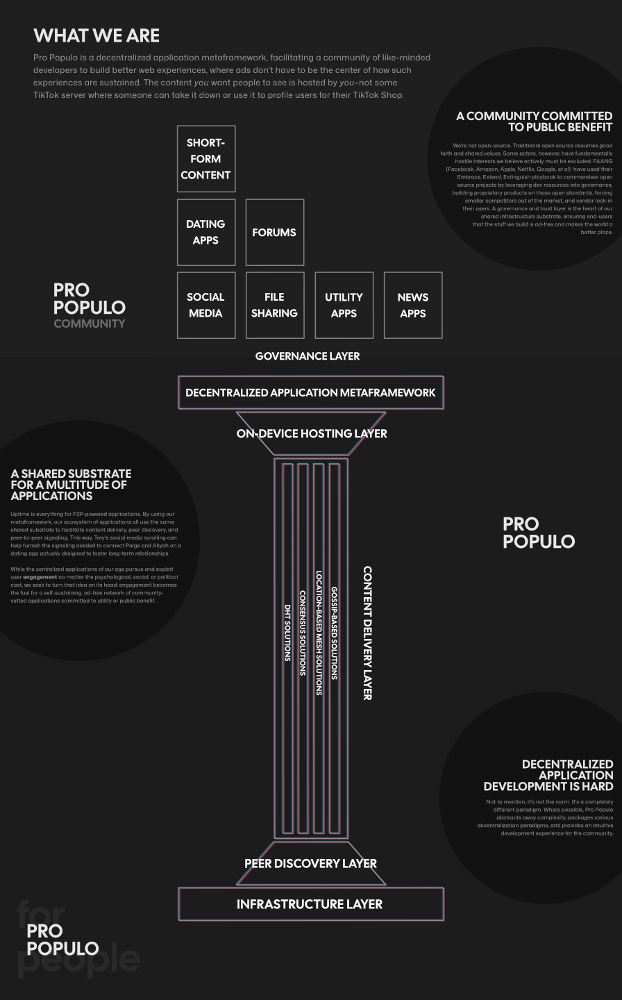

<div style="display: flex; justify-content: space-between;">
  
  
  
</div>

## Development

### Swarm Development

<div style="display: flex; justify-content: space-between;">
  
  
</div>

Developing and testing peer to peer applications requires multiple instances of the application running on different devices. The figures above show six iOS Simulators on which are installed six isolated instances of the same application all synced from the same repository. This allows all devices to respond in watch mode while only having to make changes in
one source file.

### Common Commands (macOS)

Run these from the root of the monorepo.

```
bun run ios:swarm:build [--instances <number>]
```

This runs a full build of your application's Rust binaries, starts a Vite JavaScript development server with HMR, and
installs the app binary onto all devices in the swarm. Starting on a fresh desktop, the script will use AppleScript to arrange your swarm into thirds, moving onto new desktops as needed. Building the Rust binaries takes ~5 minutes with 6 devices in parallel.

You'll only ever need to do this if you need to rebuild the Rust binaries, such as if you're using Tauri commands. Once you've done the full build and the app is installed, you can use

```
bun run ios:swarm
```

to merely perform swarm arrangement on your desktop, start the JavaScript dev servers, and sync your project with all of the isolated instances. This is a good command if you've closed out of all of your simulators, their associated terminal windows, and are resuming JavaScript development for the day.

When you're working with a whole swarm of devices, It's incredibly tedious to go to Safari and find the Simulator you're working with, enable the Develop menu, and find the Simulator you're working with to inspect it. This script is a godsend:

```
bun run ios:dev-tools
```

To run this script, you'll need to enable the Develop menu in Safari. You can do this by going to Safari > Preferences > Advanced and checking the box next to "Show Develop menu in menu bar". Then when you run it, it'll use AppleScript toopen Web Inspector windows for all running simulators and arrange them on the screen behind all of your simulators.

Inevitably, in your testing, the web view will crash. Depending on the bug it could crash one or all of the instances in your swarm. To restart the web view(s), you can use the following scripts:

```
bun run ios:restart-vite-swarm
bun run ios:restart-vite <instance-number>
```

This will restart the Vite development server and sync your project with all of the isolated instances. It'll use AppleScript to place the terminal window for the Vite server in the same position as the simulator it's associated with.

If you find yourself in a situation where an instance isn't receiving updates as you change code you can use this script. It's cross-platform, so you'll need to specify the target OS (the OS of your swarm) and the host OS (the OS where you're running the script).

```
bun run sync-swarm --targetOS <target-os> --hostOS <host-os>
```

### Getting Started

The project uses Bun as the package manager and can be started with:

```bash
bun run dev
```

This runs `turbo dev` and starts Docker Compose services including the signaling server and CoTURN server for NAT traversal.

### Script Naming Convention

All development scripts follow the pattern: `[host-os]:[target-os]:[action]`

- **host-os**: The operating system where the script runs (windows, macos, linux)
- **target-os**: The platform being targeted (android, ios, windows, web, system)
- **action**: What the script does (multi, single, setup-avds, setup-env, etc.)

**Examples:**

- `windows:android:multi` - Run multiple Android instances from Windows
- `macos:ios:single` - Run single iOS instance from macOS
- `windows:system:enable-dev-mode` - Configure Windows system settings

This convention provides clear separation between host environment and target platform, making cross-platform development intuitive and reducing cognitive overhead.

### Multi-Instance Testing

For testing peer-to-peer functionality, you can launch multiple instances of the Tauri app:

#### Windows

**Available Commands:**

```bash
# Windows Development
bun run windows:windows:multi          # Multiple Windows instances
bun run windows:windows:single         # Single Windows instance

# Android from Windows
bun run windows:android:swarm          # Multiple Android emulators
bun run windows:android:single         # Single Android emulator
bun run windows:android:setup-avds     # Create Android Virtual Devices
bun run windows:android:setup-env      # Setup Android environment

# System Configuration
bun run windows:system:enable-dev-mode # Enable Windows Developer Mode

# Services
bun run dev:services                   # Start Docker services
```

**Named Parameters:**

```bash
# Examples with PowerShell named parameters
bun run windows:windows:multi -- -NumberOfInstances 3 -Sequential $true
bun run windows:android:swarm -- -StartServices $true -NumberOfInstances 4
bun run windows:android:single -- -InstanceId 2 -EmulatorName "Pixel_7_API_34"
```

#### macOS

**Available Commands:**

```bash
# iOS Development
bun run macos:ios:swarm            # Multiple iOS simulators
bun run macos:ios:single           # Single iOS simulator

# Android from macOS
bun run macos:android:swarm        # Multiple Android emulators
bun run macos:android:single       # Single Android emulator

# Services
bun run dev:services               # Start Docker services
```

#### Android

##### Initial Setup

Before launching Launch-Swarm-Android.ps1 instances, you need to set up your development environment:

**Prerequisites:**

1. **Android Studio** - Download from https://developer.android.com/studio
2. **Java JDK 17+** - Required for Android SDK tools
3. **Android NDK** - Install via Android Studio SDK Manager

**Environment Variables:**

- `JAVA_HOME` - Path to your Java installation
- `NDK_HOME` - Path to Android NDK (e.g., `C:\Users\{username}\AppData\Local\Android\Sdk\ndk\{version}`)
- `PATH` - Must include Android SDK platform-tools and emulator directories

**Automated AVD Setup:**
Use the provided script to create multiple Android Virtual Devices for testing:

```bash
# Setup Android environment and AVDs
bun run windows:android:setup-env      # Configure environment variables
bun run windows:android:setup-avds     # Create test devices
```

This script will:

- Automatically find your Android SDK installation
- Install required system images (API 34, 33)
- Create multiple Pixel device AVDs:
  - Pixel 7 API 34
  - Pixel 6 API 34
  - Pixel 5 API 34
  - Pixel 4 API 34
  - Pixel 3a API 34
  - Pixel 2 API 34

##### Multi-Instance Launching

**Available Commands:**

```bash
# Android Development (Windows host)
bun run windows:android:swarm          # Multiple Android emulators
bun run windows:android:single         # Single Android emulator

# Android Development (macOS host)
bun run macos:android:swarm            # Multiple Android emulators
bun run macos:android:single           # Single Android emulator
```

**Named Parameters:**

```bash
# Windows (PowerShell style with single dash)
bun run windows:android:swarm -- -NumberOfInstances 3 -Sequential $true
bun run windows:android:swarm -- -StartServices $true -NumberOfInstances 4
bun run windows:android:single -- -InstanceId 2 -EmulatorName "Pixel_7_API_34"

# macOS (bash style with double dash)
bun run macos:android:swarm -- --instances 3 --sequential true --services false
bun run macos:ios:swarm -- --instances 2 --sequential false
bun run macos:android:single -- --instance 1 --emulator "Pixel_7_API_34"
bun run macos:ios:single -- --instance 1 --simulator "iPhone 15"
```

**Available Parameters:**

- **Multi-instance scripts**: `instances/NumberOfInstances`, `sequential/Sequential`, `services/StartServices`
- **Single instance scripts**: `instance/InstanceId`, `emulator|simulator/EmulatorName|SimulatorName`

## Testing

The project includes a comprehensive test suite for validating swarm launch scripts across platforms.

### Running Tests

```bash
# Run all tests
bun run test

# Run specific test categories
bun run test:scripts              # All script tests
bun run test:scripts:unit         # Unit tests only
bun run test:scripts:integration  # Integration tests only
bun run test:scripts:e2e          # End-to-end tests (requires appropriate SDKs)

# Run with coverage
bun run test:scripts:coverage
```

### Test Categories

**Unit Tests** (`tests/scripts/unit/`)

- Parameter parsing validation for PowerShell and bash scripts
- Cross-platform parameter consistency checks
- Input validation and error handling

**Integration Tests** (`tests/scripts/integration/`)

- Script execution with mocked Android/iOS tools
- Multi-instance launch orchestration
- Port allocation and device management

**End-to-End Tests** (`tests/scripts/e2e/`)

- Real emulator/simulator launching (disabled by default)
- Requires appropriate SDKs (Android SDK on all platforms, Xcode on macOS)
- Enable with `RUN_E2E_TESTS=true` or `CI=true`

### Platform-Specific Behavior

- **Windows**: PowerShell tests run, bash tests skipped
- **macOS/Linux**: Both PowerShell and bash tests run
- **Test Mode**: All scripts run in dry-run mode to prevent actual emulator launches
- **Mock Tools**: Fake `adb`, `emulator`, and `xcrun` commands for safe testing

### Test Configuration

Tests use sequential execution to prevent resource conflicts and include:

- 30-second timeout for PowerShell script execution
- Automatic test environment setup and cleanup
- Suppressed Docker warnings and external tool noise
- Clean output with minimal logging
